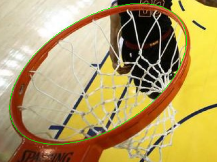
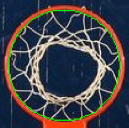
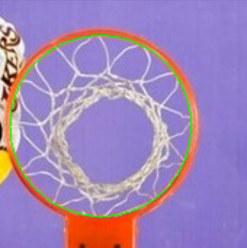
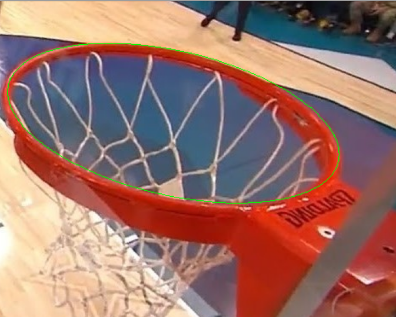
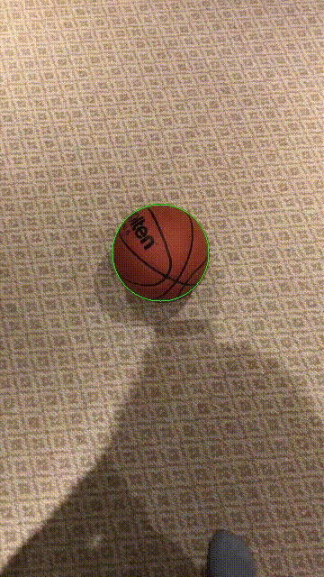

# Overview 

This is just an ongoing personal project to track basketballs through the air with computer vision. 

Most young basketball players don't know WHY they are missing shots, they just know they need to improve, and in most programs there aren't enough coaches to keep track of everyone's shooting tendencies. Furthermore, most high school and elementary school basketball programs have very limited budgets. To help young basketball players improve, I've started working on this project. 

Then end goal is to position a cheap camera above the rim (similar to NBA's bird eye view cameras above the backboard) in order to track the ball through the air. Although significant testing for accuracy would be required, I hope to be able to track the following for each shot:
- Make or miss
- Shot angle (with respect to hand)
- Left/right sway angle with respect to center of rim
- Final x,y position on the plane containing the rim
- Shot position on court (this would require the shooter's height)

There are three major components that have been implemented so far:
- The rim finding algorithm
- The ball tracking (using TensorFlow models trained on the COCO dataset)
- The fitting and parameterizing of the parabola

As things currently stand, this repository is **not implemented to be used** (notive that there is no license). In fact, the code will not even work because I have filepaths specified locally on my machine. The goal is simply to showcase how the project is coming along via images and videos I have created using the code. 

Over the coming weeks, I plan on commenting, formatting and documenting the code so that it can actually be used by other programmers who also like coaching basketball.

## Rim Finding Algorithm Examples

Note: this is not object detection, and therefore, the algorithm takes the color of the rim as input. Because of this, if there isn't sufficient contrast between the rim and background, the algorithm will fail miserably. Also, these are not simply drawn on, the rims are stored as OpenCV ellipse objects.

## Ball Tracking Examples

Note: currently, on my machine, these videos are not being generated in real time (the inference is too slow). 

